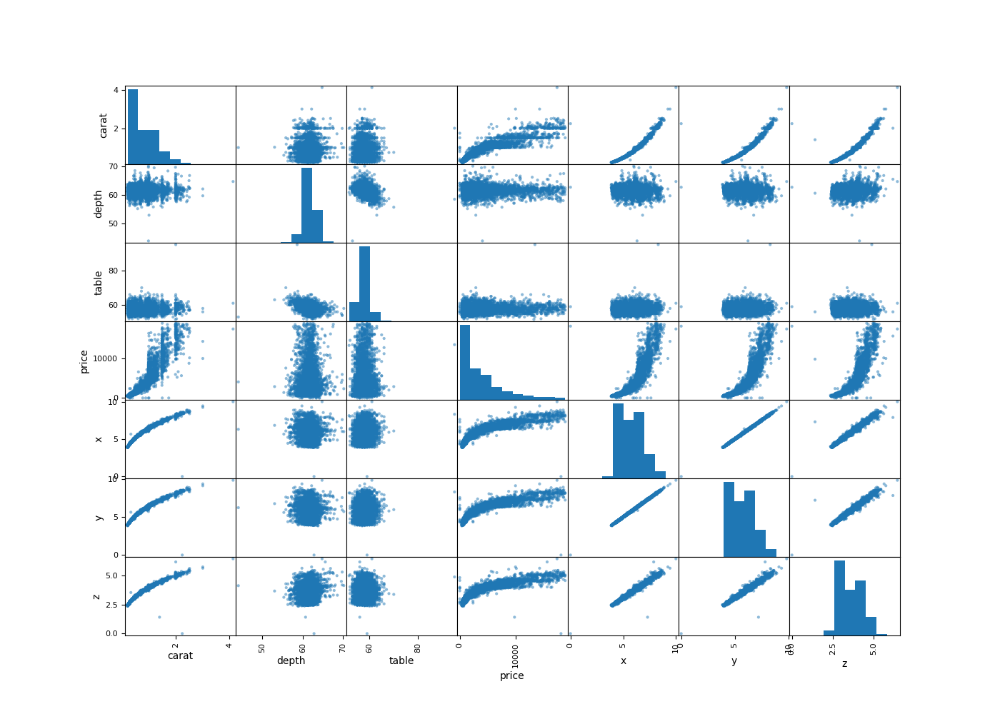
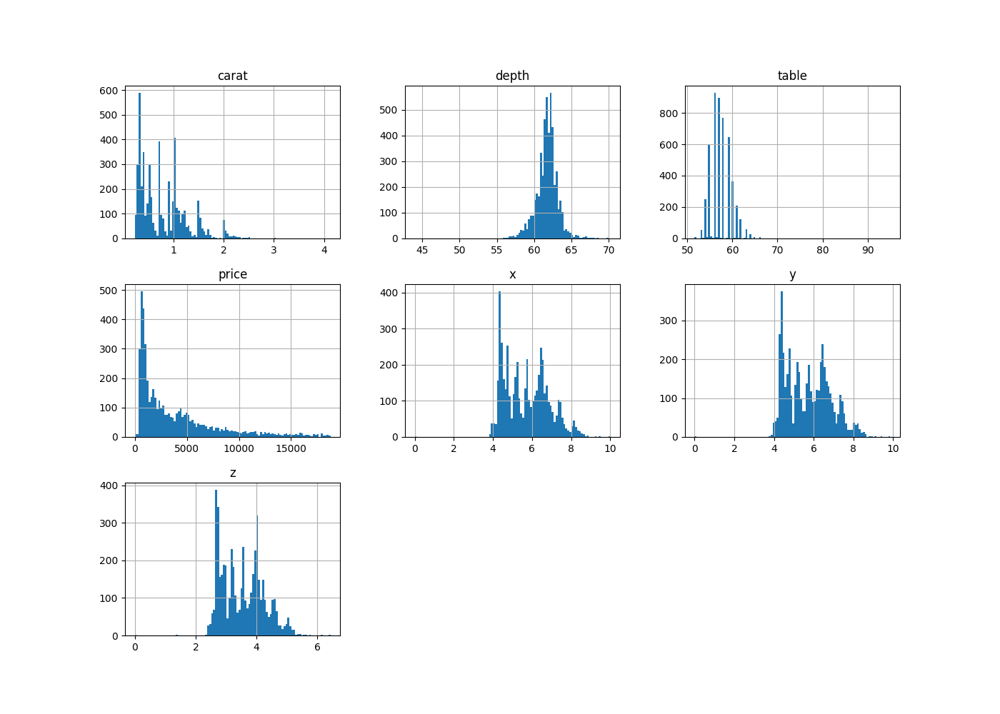
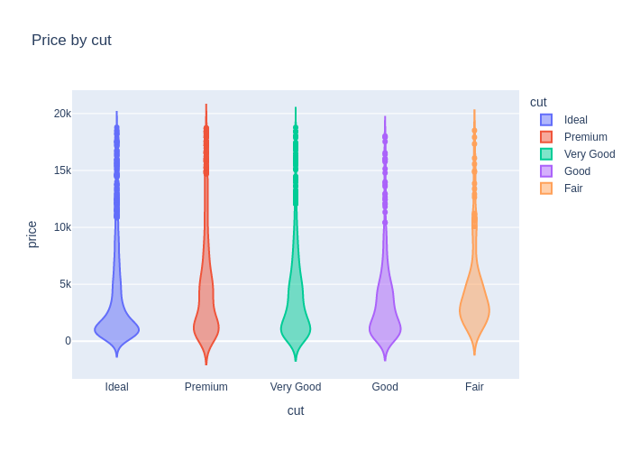
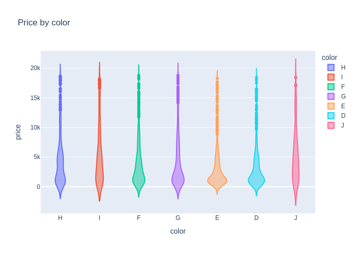
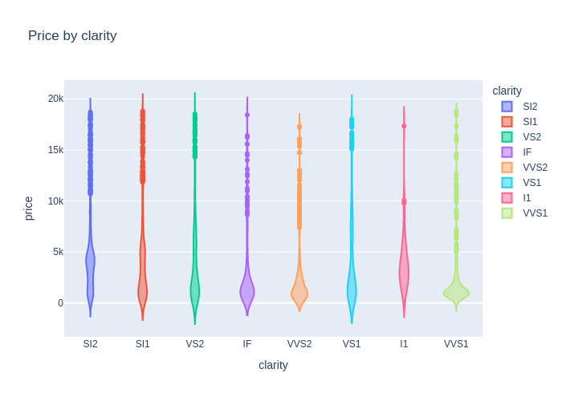
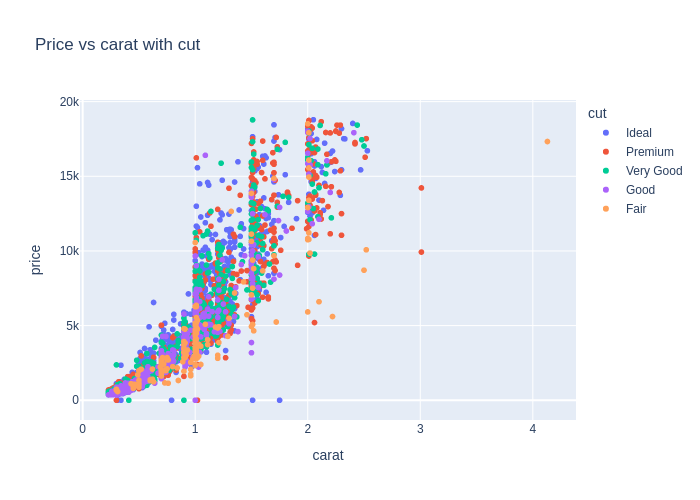
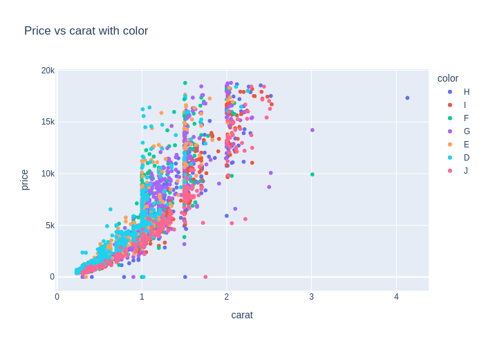
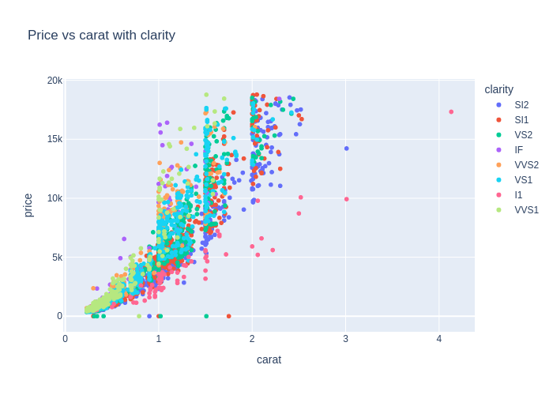

# Data Exploration Report

## Missing Values

|         |   0 |
|:--------|----:|
| carat   |   0 |
| cut     |   0 |
| color   |   0 |
| clarity |   0 |
| depth   |   0 |
| table   |   0 |
| price   |   0 |
| x       |   0 |
| y       |   0 |
| z       |   0 |

## Basic Statistics

|       |       carat |      depth |     table |    price |          x |          y |           z |
|:------|------------:|-----------:|----------:|---------:|-----------:|-----------:|------------:|
| count | 5000        | 5000       | 5000      |  5000    | 5000       | 5000       | 5000        |
| mean  |    0.794486 |   61.7117  |   57.4471 |  3925.54 |    5.72519 |    5.72774 |    3.53308  |
| std   |    0.468424 |    1.44621 |    2.259  |  3975.45 |    1.11916 |    1.11211 |    0.690334 |
| min   |    0.23     |   44       |   51.6    |    -1    |    0       |    0       |    0        |
| 25%   |    0.4      |   61       |   56      |   936    |    4.7     |    4.71    |    2.9      |
| 50%   |    0.7      |   61.8     |   57      |  2392.5  |    5.69    |    5.7     |    3.53     |
| 75%   |    1.04     |   62.5     |   59      |  5369.25 |    6.54    |    6.54    |    4.03     |
| max   |    4.13     |   70.2     |   95      | 18787    |   10       |    9.85    |    6.43     |

## Zero Dimensional Items (Data Errors)

|      |   carat | cut     | color   | clarity   |   depth |   table |   price |   x |   y |   z |
|-----:|--------:|:--------|:--------|:----------|--------:|--------:|--------:|----:|----:|----:|
| 4321 |    2.25 | Premium | H       | SI2       |    62.8 |      59 |   18034 |   0 |   0 |   0 |

## Nonpositive Price Items (Data Errors)

|      |   carat | cut       | color   | clarity   |   depth |   table |   price |    x |    y |    z |
|-----:|--------:|:----------|:--------|:----------|--------:|--------:|--------:|-----:|-----:|-----:|
|  331 |    1    | Good      | F       | SI1       |    64.1 |      60 |      -1 | 6.25 | 6.19 | 3.99 |
| 2121 |    0.34 | Ideal     | E       | VS2       |    59.8 |      56 |      -1 | 4.55 | 4.54 | 2.72 |
| 2484 |    1.75 | Ideal     | J       | SI1       |    63.3 |      59 |      -1 | 7.63 | 7.57 | 4.81 |
| 2933 |    1.51 | Ideal     | H       | VS2       |    62.5 |      55 |      -1 | 7.29 | 7.34 | 4.57 |
| 3155 |    0.31 | Ideal     | G       | VS2       |    61.7 |      57 |      -1 | 4.33 | 4.36 | 2.68 |
| 3317 |    1.02 | Premium   | D       | VS2       |    59.8 |      61 |      -1 | 6.61 | 6.54 | 3.93 |
| 3445 |    0.3  | Premium   | H       | SI1       |    59.3 |      59 |      -1 | 4.38 | 4.36 | 2.59 |
| 3904 |    0.9  | Very Good | G       | SI2       |    64.2 |      56 |      -1 | 6.04 | 6.11 | 3.9  |
| 3980 |    0.41 | Very Good | H       | VS2       |    63.4 |      58 |      -1 | 4.77 | 4.66 | 2.99 |
| 4188 |    0.79 | Ideal     | H       | VVS1      |    62   |      56 |      -1 | 5.92 | 5.96 | 3.68 |

## Scatter Matrix Plot
  

## Histograms
  

## Price-by Diamonds Plot
  

  

  

## Price-by Scatter Diamonds Plot
  

  

  

